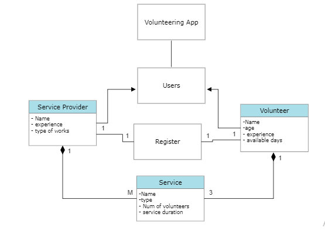
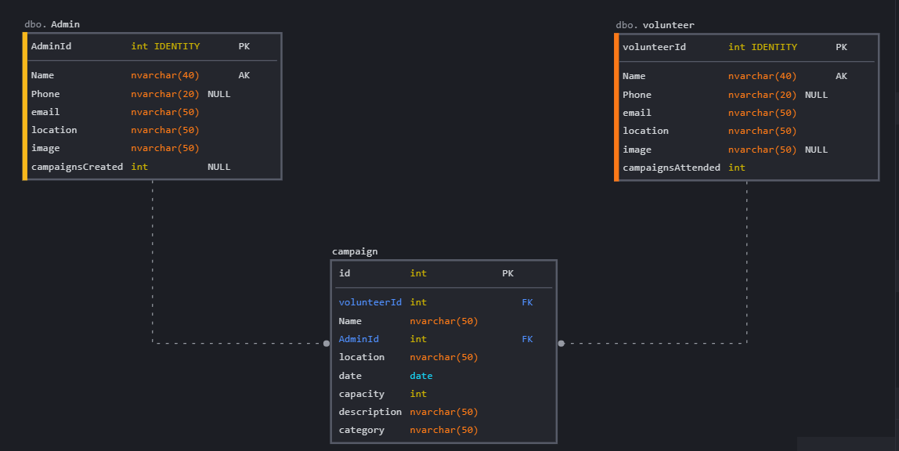

## Team-members:
- Yousef Farwan
- Malak Odtalla
- Abdulrahman Mansour
- Mohammed Lebzo
- Sondos Abu-Qiass

## Description:

The **Helping Hands** application allows the campaign organizers and volunteers to find eachother, and to be able to connect and communicate effectively.
## User Stories:
The user stories are located in the [project management board](https://trello.com/b/K1n2wxGo/final-project-helping-hands), on Trello.

## Wireframe: [wireframe image](images/WireFrame.png)

## Domain Modeling

## Database Schema Diagram
